# VFPR - a Vulkan Forward Plus Renderer

### A final project for University of Pennsylvania, CIS 565: GPU Programming and Architecture

[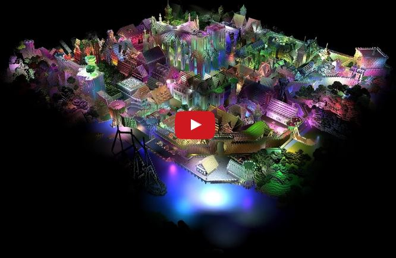](https://www.youtube.com/watch?v=ZLNDfPxhqdE)

In this project, we created a Forward Plus (tiled forward) renderer in Vulkan using compute shader to deal with light culling.

Our implementation is __~1000%__ faster than regular forward renderer (tested in Vulkan) under the condition of 200 lights.

Yes, Vulkan is really powerful! We learned about Vulkan at SIGGRAPH 2016 at Anaheim, and decided to dive into it at our final project. We learned a lot from [Alexander Overvoorde's](https://vulkan-tutorial.com/) Vulkan Tutorial, great resource! Thanks so much!

Let us give you a very detailed introduction about our project.  :)

**Team Members**
* Ruoyu Fan
 * [Website](http://windy.moe/portfolio)
 * [LinkedIn](https://www.linkedin.com/in/ruoyuf)
 * [Github](https://github.com/WindyDarian)
* Xueyin Wan
 * [Website](http://xueyin.me/)
 * [Linkedin](https://www.linkedin.com/in/xueyin-wan)
 * [Github](https://github.com/xueyinw)

**Tested on: Windows 10 x64, i7-6700K @ 4.00GHz 16GB, GTX 970 4096MB (Personal Desktop)**

# Overview of Forward Plus Technique
Our ideas of this cool renderer are from this amazing paper: [Forward+: Bringing Deferred Lighting to the Next Level](https://takahiroharada.files.wordpress.com/2015/04/forward_plus.pdf). Thanks so much for the incredible authors!

Forward plus actually is an extension to traditional forward rendering. In forward rendering, it normally limits the number of lights to be valued when shading, which also limits the visibility computation.

Forward plus extends the forward rendering pipeline by adding a light-culling stage before final shading. Basically this pipeline consists of three stages: depth prepass, light culling, and final shading. We will share more about these stages immediately combined with our Vulkan structure. The advantage of this method is that the scene could be rendered with many lights by culling, and storing only lights that contribute to the tile. Definitely a cool technique, right? :)

Now, let us introduce these three stages in our basic forward plus renderer. In our project, since we use Vulkan, we create three command buffers for each single step.

* Step 1: Depth Pre-pass

We inplemented this step by creating a pipeline without fragment shader in Vulkan. This enables depth-write and depth test.

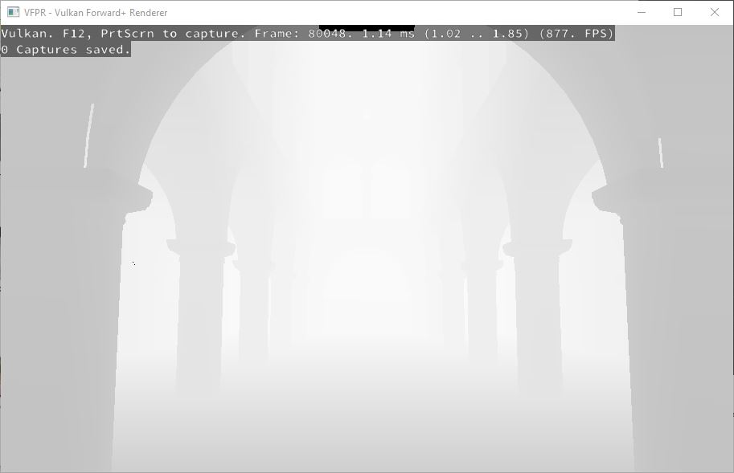

As the picture above shows, this will output a depth map, which could be used as an input for light culling stage.

* Step 2: Light Culling

light culling calculates a list of light indices overlapping a tile. In our project, the default tile size is 16 * 16.

As we mentioned above, the depth map generated from the depth prepass stage is used to determine the minimum and maximum depth values within a tile, that is the minimum and maximum depths across the entire tile.

It is noticable that in Vulkan, we add a compute shader for this stage between renderpass one (depth prepass) and renderpass two (final shading).

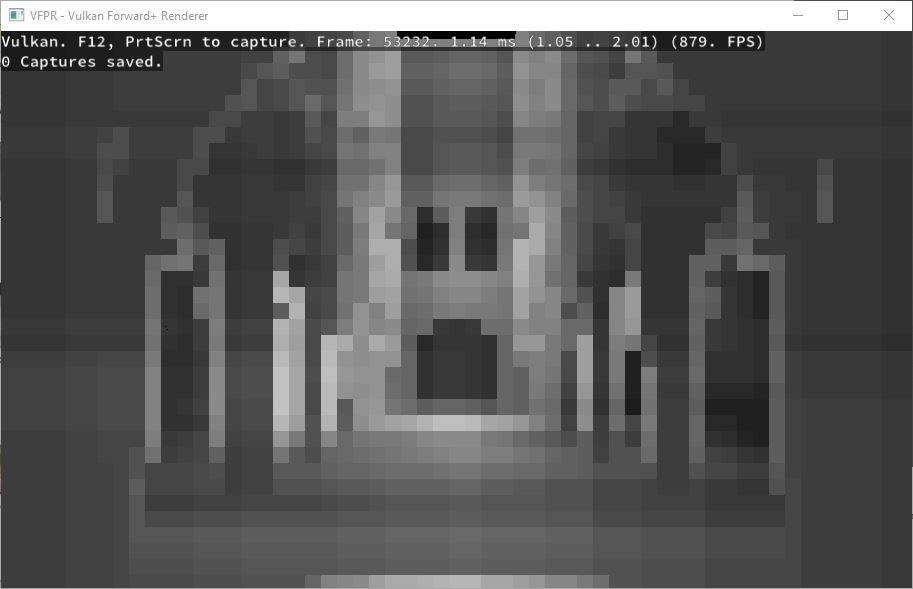

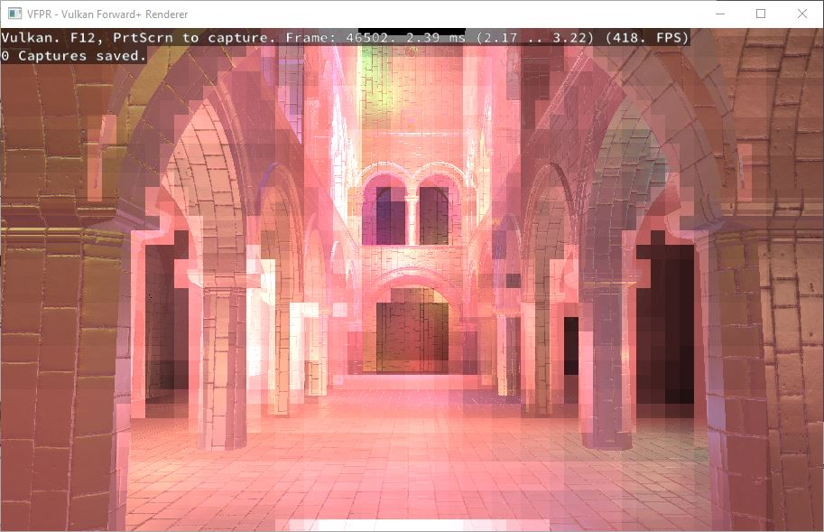

* Step 3: Light Accumulation and Final Shading

Lastly, we created another renderpass for final shading, which accumulates all the lights in the light list we calculated for each tile, then we do the final shading based on the results.
For loading more materials, we run the pipeline for each material group to enable the full scene of sponza.

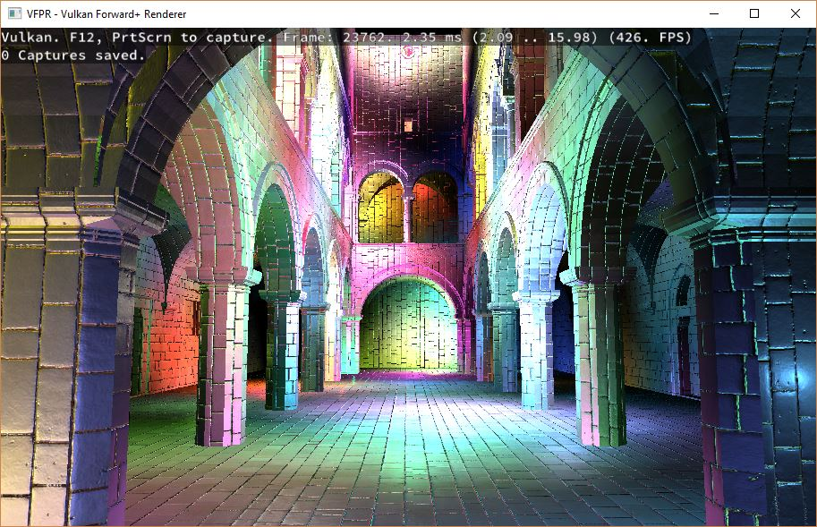

# UPenn CIS 565 Course Presentation Slide
[Please Click Here!!!](https://docs.google.com/presentation/d/1ZQc1wVHuK4elNLhtdMFzwf1gdOJYCIUj3u9yL1qS2eM/edit#slide=id.g1a4ecd687d_0_20)

# Debug Views

| Render           | Heatmap          |
|------------------|------------------|
|  |  |

| Heatmap Only     | Depth Pre-Pass Result |
|------------------|------------------|
|  |  |

For the heatmap part, if the tile in the image is lighter than other places, that means more lights will effect its bounding frustum.

#### Frame Breakdown
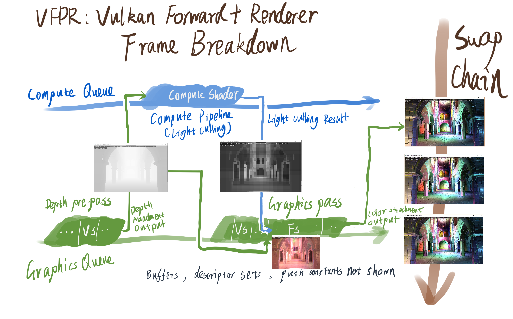

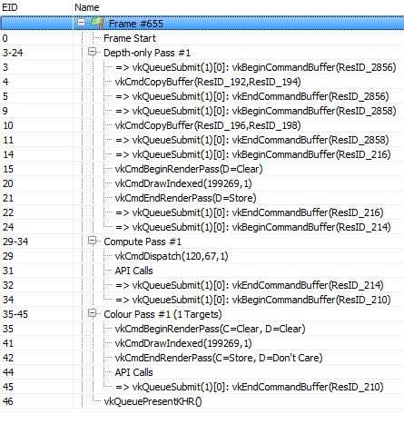

# Performance Analysis

In our analysis, we use two scenes

### Sponza scene:  262,267 triangles, 145,186 vertices


### Rungholt scene: 5,815,868 triangles, 3,289,722 vertices


## Forward VS Forward Plus

_NOTE: performance comparison is based on commit [e4b440b](https://github.com/WindyDarian/Vulkan-Forward-Plus-Renderer/tree/e4b440b76af5f43b1a3cace830b34432551807d7) (Forward+ shading) and [de332d2](https://github.com/WindyDarian/Vulkan-Forward-Plus-Renderer/tree/de332d2d30c79daa2ebfbc81b244f5d07d43ed6b) (forward shading)_

As we mentioned above, for the forward renderer, we need to calculate each light for each fragment for the entire scene, which is definitely not a good enough choice.

And for Forward Plus, we only need to consider about the list of light we calculated that overlaps a tile.

Since this comparison is very important for our project and research, we test lots of cases in order to get a accurate test result.

Here we draw a chart to list our results:

| -                                 | Forward+ ms per frame | Forward ms per frame | Forward+ FPS | Forward FPS |
|-----------------------------------|-----------------------|----------------------|--------------|-------------|
| Sponza 10 lights (5.0f)           | 2.71                  | 5.98                 | 369          | 167.22      |
| Sponza 200 lights (5.0f)          | 5.97                  | 55.95                | 167.5        | 17.9        |
| Sponza 1000 small lights (2.0f)   | 4.91                  | 264.82               | 203.66       | 3.78        |
| Sponza 1000 lights (5.0f)         | 21.98                 | 268.26               | 45.5         | 3.73        |
| Sponza 1000 large lights (10.0f)  | 73.23                 | 293.09               | 13.66        | 3.41        |
| Sponza 20000 small lights (2.0f)  | 54.83                 | Crashed Computer     | 18.23        | N/A         |
| Rungholt 10 lights (vertex heavy) | 9.9                   | 8.72                 | 101.01       | 114.68      |
| Rungholt 200 lights               | 11.82                 | 122.43               | 84.6         | 32.67       |
| Rungholt 1000 lights              | 24.59                 | 641.06               | 40.67        | 1.56        |
| Rungholt 20000 lights             | 345.82                | Crashed Computer     | 2.89         | N/A         |

We could see a huge performance increasement after we use Forward Plus Renderer.

###  Different Light Num

First, we choose light num as a variable to dive into forward vs forward plus.

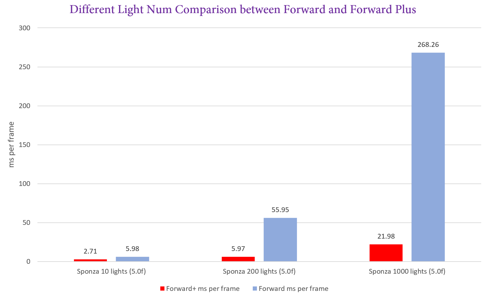

For the same sponza scene, if we have the same light radius, let's say 5.0f, we could see that:
* For forward renderer, the time for per frame just increases linearly according to the light num increasement.
* For forward plus renderer, the time for per frame increases as well, according to the light num increasement.
* But we can notice that, FORWARD PLUS IS MUCH MUCH FASTER THAN FORWARD SHADING When the light num is huge, forward plus could be 10 TIMES FASTER than forward shading.

Alright, then we choose Rungholt scene as our test scene. The thing happens here is that Rungholt scene is much larger than Sponza scene, and it is vertex heavy. Interesting thing happens!
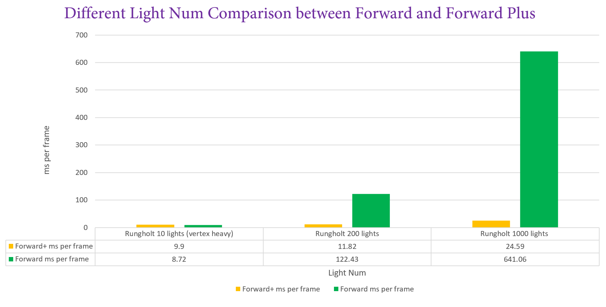
* When the light num is small, forward shading is faster!!! (Only happens at Rungholt 10 lights situation) WHY? This is because when we do forward plus, we need two times vertex transformation, and combined with a compute shader. But for forward renderer, there's not so much passes, which makes its efficiency better than forward plus (but only happens at vertex heavy and very small light num scene).
* For forward renderer, the time for per frame still increases linearly according to the light num increasement. We could see that the time needed for one frame is a lot more than Sponza scene, with the same num of lights and same radius of lights. Also, if the lights arrives 20000, the computer just crashed.
* For forward plus renderer, the advantage appears more apparantly. We could see that even though this is a large scene and even though it is vertex heavy, forward plus could still deal with this appropriately. And we noticed that the increasement of time per frame is not linearly increased with light num. This is because forward plus is not only affected by light num, but also affected by light radius.
* FORWARD PLUS IS MUCH MUCH FASTER THAN FORWARD SHADING When the light num is huge, forward plus could be more than 10 TIMES FASTER than forward renderer.

### Different Light Radius

As we mentioned above, forward plus renderer time efficiency is also related to light radius.

Here we draw a chart to show the case.

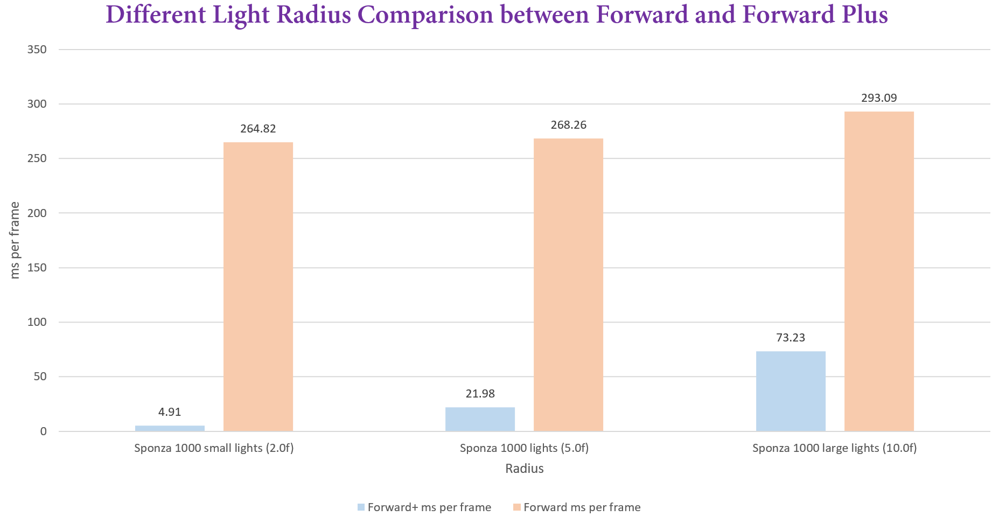

When we are using 1000 large lights in the Sponza scene, from the above chart we could see that:
* If we increase the light radius, time per frame for forward plus renderer increases a lot!! This is because if the light radius becomes longer, each tile will be more likely to be covered by the lights(since they have large radius). Not hard to imagine our test result.
* We notice that if we increase the light radius, forward renderer is not that heavily affected compared with forward plus renderer.
* Also we notice a very interesting result that is: in sponza scene, if we have 20000 small lights with small radius (2.0f, 73.23ms), it is fast than we have 1000 large lights with large radius(10.0f, 54.83ms) for forward plus renderer!

After this very careful and detailed comparison, WE FEEL SO PROND TO SEE THE PROGRESS WE MADE ABOUT FORWARD PLUS RENDERER!!!!!!

## Tile Size

Here we draw a chart to show the differences among different tile sizes.

We do our test using Full Version Sponza scene, with 1000 small lights (radius is 2.0f), and tile capacity is 1023 lights.

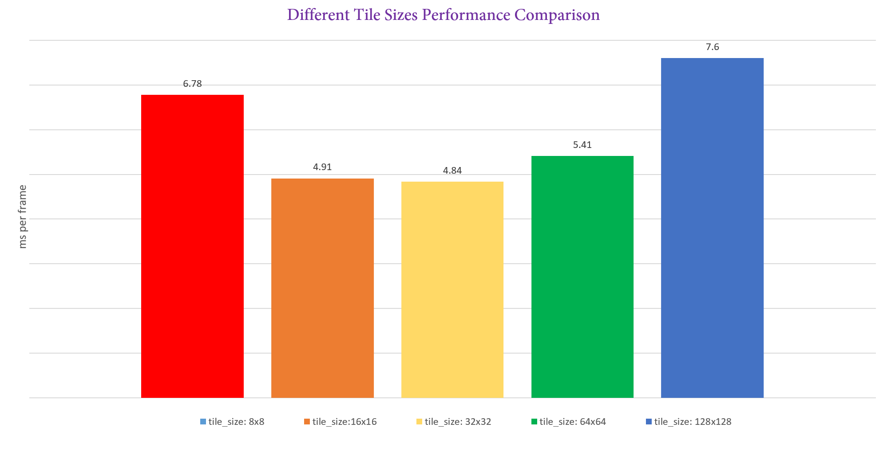

It is worth mentioning that with Vulkan, the FPS is really high, for the different tile sizes: 8x8, 16x16, 32x32, 64x64, 128x128, the FPS are correspondingly 147.49, 203.66, 211.57, 184.84, 131.58.

How to choose our default tile size? We know that in Vulkan, if the tile size is too small, it will cause huge amount of computations during the culling process, since the tile is small, and the frustums as a result are a lot more.
But if we increase the tile size to some extent, it will definitely cause each thread to do a huge amount of computations than small tile sizes, which is not optimized as well.

We also notice that with different tile sizes, the percentage of the three stages are different. Let us draw a chart to show our test result.

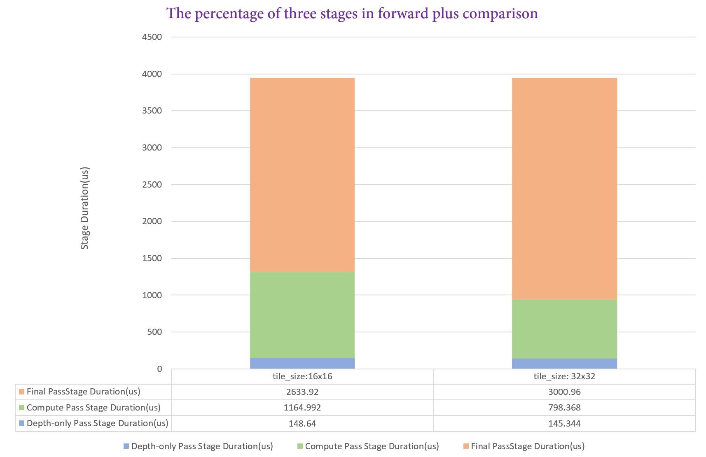

So what we need to do is to choose a balanced tile size that could make both sides fully operated.

Considered all the situations above, we choose 16 x 16 as the best size for our scene :)

## Light Per Tile

In this test, we use the scene full sponza, and use 1000 small lights (radius is 2.0f). The tile size is 16x16.

We compare between 63 lights per tile and 1023 lights per tile.

First is the ms per frame comparison:

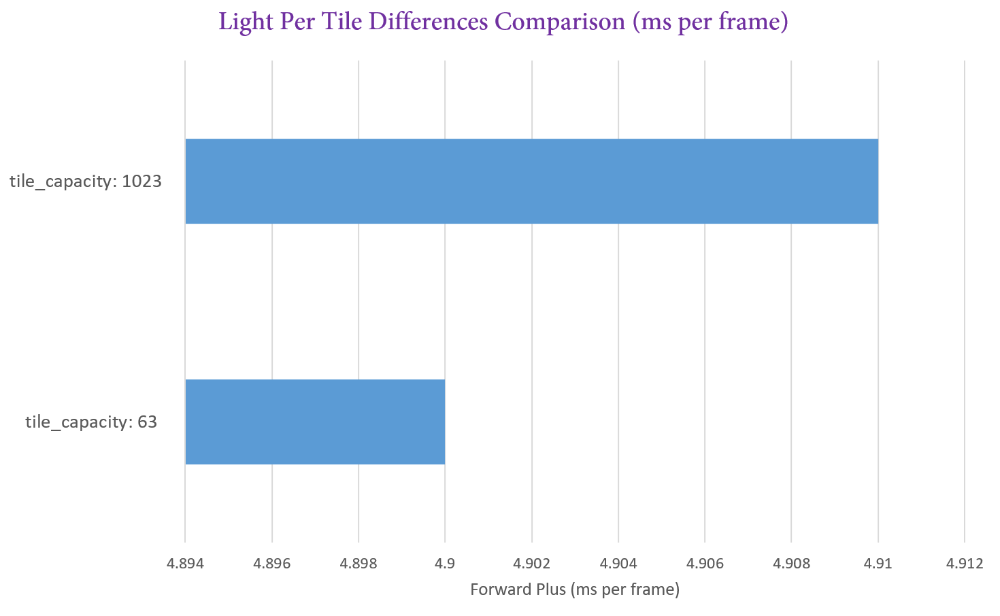

We can see that in the chart above, when there are 63 lights per tile, we need 4.9 ms for one frame, and for 1023 lights per tile case, we need 4.91 ms for one frame. The difference is not that big!

The second is the SSBO (Shader Storage Buffer Object) Comparison:
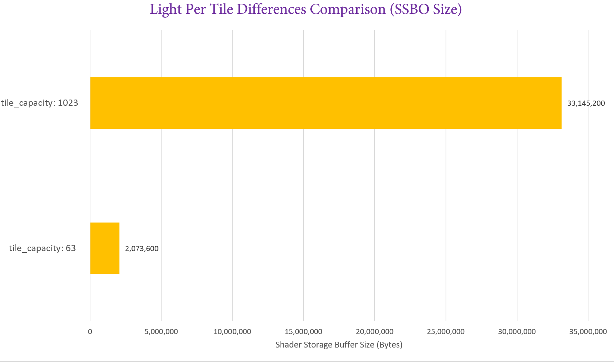

We can see that in this comparison,  we find big difference. When there are 63 lights per tile, the SSBO size is 2,073,600 bytes. But when there are 1023 lights per tile, the SSBO size is 33,145,200 bytes.

As for graphics card, the memory is not that large, so after this comparison, we find that we better choose small lights per time, which could save a lot of memory, at the same time keep a high FPS.

# Install and Build Instructions

Use CMake to build the program.

Download [Rungholt model](http://graphics.cs.williams.edu/data/meshes.xml) and put in content folder, if you need it.

#### Windows

1. Make sure you have Vulkan SDK and Visual Studio 2015 or up, then:
```
mkdir build
cd build
cmake-gui ..
```
2. And `Configure`(select `"Visual Studio 2015 x64"`), `Generate`, then you have Visual Studio project files.

3. Set `vfpr` as startup project and build solution


#### Linux
Make sure `VULKAN_SDK` is set to `x86_64` folder under Vulkan SDK path and you have `LD_LIBRARY_PATH` and `VK_LAYER_PATH` set by running `source ./setup-env.sh` at Vulkan SDK folder, and then
```
mkdir build
cd build
cmake ..
make
```

#### Controls

```
Pressing RMB and move cursor: rotate camera
W, S, A, D, Q, E: move camera
Z: toggle debug view
```

#### Tips

* Change the line `	getGlobalTestSceneConfiguration() = sponza_full_1000_small_lights; ` in __main.cpp__ to test with different scene and configurations
* Run the program using RenderDoc to see FPS in realtime (for now). Or you can peek the average FPS at console when the program is closed.

# Milestones : How we finish our project step by step :)

### Milestone 1 (11/21/2016)
* Basic Vulkan framework including:
  * basic forward rendering pipeline (adaptd from [Vulkan Tutorial by Alexander Overvoorde](https://vulkan-tutorial.com))
  * mesh
  * texture mapping
  * lambert shading
* Cross Platform using GLFW & CMake (Windows, Linux)

### Milestone 2 (11/28/2016)
* Forward+ framework in progress:
  * Camera control
  * Huge amount of Point lights
  * Normal mapping
  * Blinn-Phong Shading

### Milestone 3 (12/12/2016)
* Full version of Forward+ pipeline:
  * Compute pipeline
  * Share descriptor sets for lights and camera to use compute pipeline output as fragment shader input.
    * Also used some push constants for the change of tile numbers after resizing window
  * Tile frustum light culling
  * Depth pre-pass (depth pre-pass + depth culling + light culling all done!)
  * Switch between debug views (HeatMap, Normals, Depth map, etc.)

### Fianl Milestone (12/15/2016)
* Make Forward+ Renderer powerful!
  
  * Add Load Model Feature, which supports multiple materials and full version of Sponza Model
  * Refactor code to be clean and documented :)
  * Compared between Sponza Scene and Rungholt Scene
  * Polished Readme and Performance Analysis

# Third-Party Credits

#### References
* [Vulkan Tutorial by Alexander Overvoorde](https://vulkan-tutorial.com)
* [Correct Frustum Culling](http://www.iquilezles.org/www/articles/frustumcorrect/frustumcorrect.htm)
* [Forward+: Bringing Deferred Rendering to the Next Level](https://takahiroharada.files.wordpress.com/2015/04/forward_plus.pdf)
    * Takahiro Harada, Jay McKee, and Jason C. Yang
* [EUROGRAPHICS 2012 Slide Deck](http://www.slideshare.net/takahiroharada/forward-34779335)

#### Libraries
* [CMake](https://cmake.org/)
* [GLFW](http://www.glfw.org/)
* [GLM](http://glm.g-truc.net/0.9.8/index.html)
* [stb_image](https://github.com/nothings/stb)
* [tinyobjloader](https://github.com/syoyo/tinyobjloader)

#### Assets
* [Chalet Hippolyte Chassande Baroz by Gaël](https://skfb.ly/HDVU)
* [Crytek Sponza](http://www.crytek.com/cryengine/cryengine3/downloads)
* Rungholt from [McGuire, Computer Graphics Archive, Aug 2011](http://graphics.cs.williams.edu/data)

#### Tools
* [RenderDoc](https://github.com/baldurk/renderdoc)  (debugging became a lot easier)
